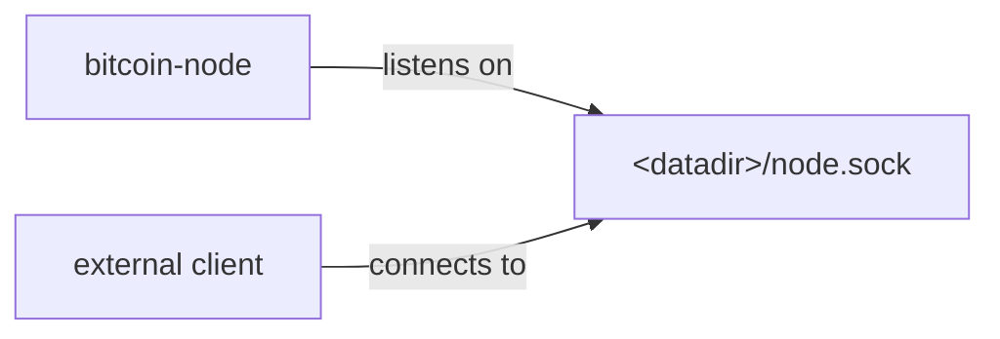
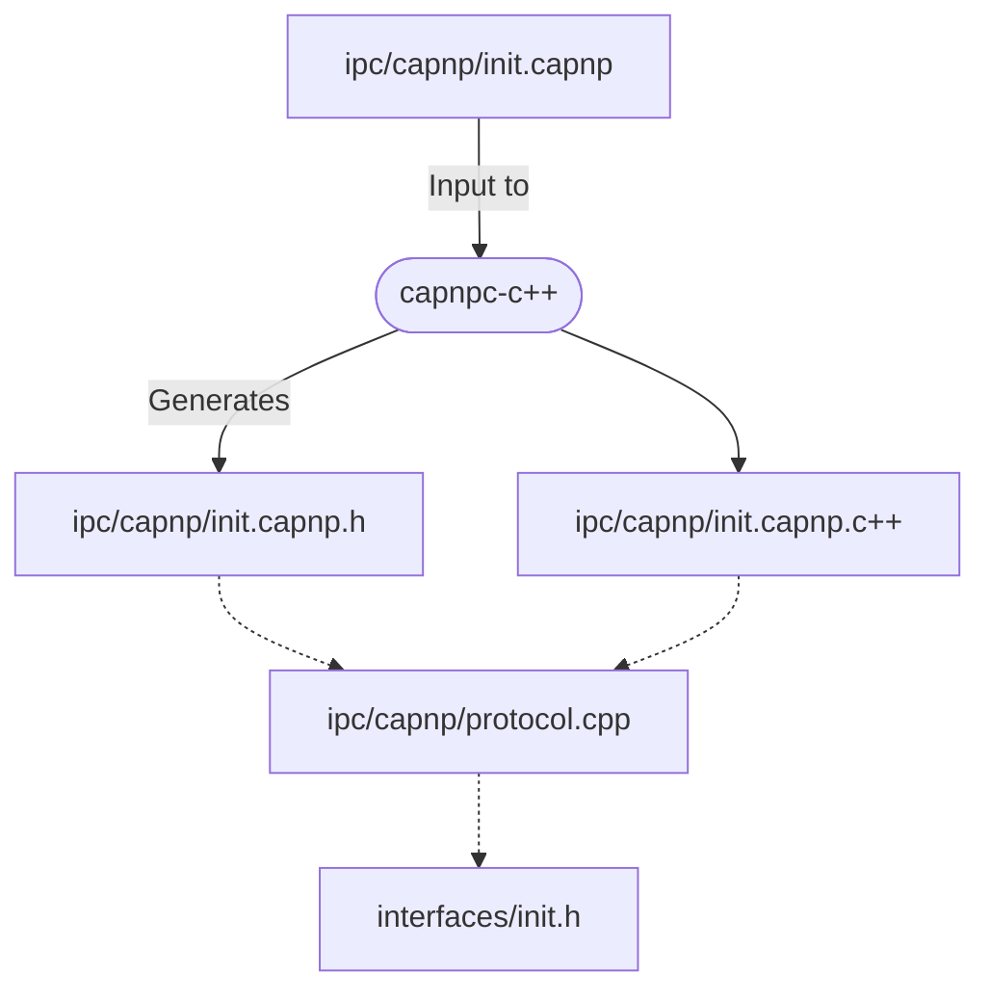
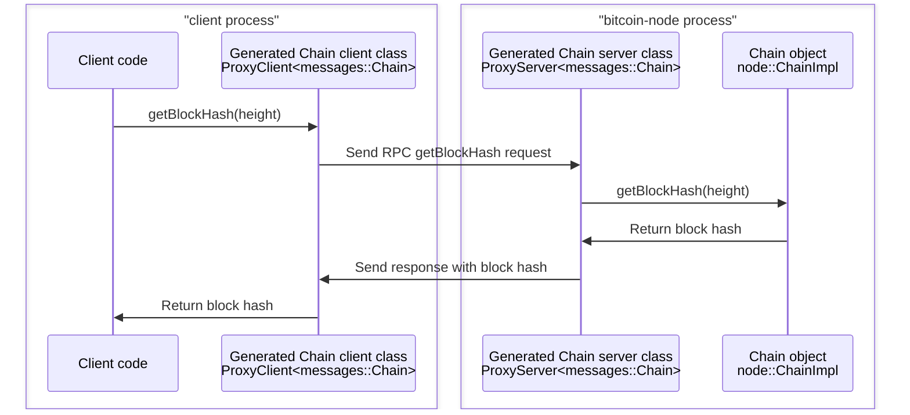

# Multiprocess Bitcoin Design Document

Guide to the design and architecture of the Bitcoin Core multiprocess feature

_This document describes the design of the multiprocess feature. For usage information, see the top-level [multiprocess.md](../multiprocess.md) file._

## Introduction

The Bitcoin Core software has historically employed a monolithic architecture. The existing design has integrated functionality like P2P network operations and indexes into a single executable. While effective, it has limitations in flexibility, security, and scalability. This project introduces changes that transition Bitcoin Core to a more modular architecture. It aims to enhance security, improve usability, and facilitate maintenance and development of the software in the long run.

## Current Architecture

The current system features one primary executable: `bitcoind`. `bitcoind` combines a Bitcoin P2P node with an integrated JSON-RPC server and indexes. This monolithic structure, although robust, presents challenges such as limited operational flexibility and increased security risks due to the tight integration of components.

## Proposed Architecture

The new architecture allows separating internal components into specialized executables, communicating over IPC. For example, indexes could be removed from the `bitcoin-node` executable and run in separate executables, listening and responding to RPC requests on their own ports, without needing to forward RPC requests through `bitcoin-node`.

<table><tr><td>

</td></tr><tr><td>
Processes and socket connection.
</td></tr></table>

## Component Overview: Navigating the IPC Framework

This section describes the major components of the Inter-Process Communication (IPC) framework covering the relevant source files, generated files, tools, and libraries.

### Abstract C++ Classes in [`src/interfaces/`](../../src/interfaces/)
- The foundation of the IPC implementation lies in the abstract C++ classes within the [`src/interfaces/`](../../src/interfaces/) directory. These classes define pure virtual methods that code in [`src/node/`](../../src/node/) and other modules call to interact with each other.
- Each abstract class in this directory represents a distinct interface that the different modules implement and use for cross-process communication.
- The classes are written following conventions described in [Internal Interface
  Guidelines](../developer-notes.md#internal-interface-guidelines) to ensure
  compatibility with Cap'n Proto.

### Cap’n Proto Files in [`src/ipc/capnp/`](../../src/ipc/capnp/)
- Corresponding to each abstract class, there are `.capnp` files within the [`src/ipc/capnp/`](../../src/ipc/capnp/) directory. These files are used as input to Cap'n Proto's C++ compiler to generate low-level RPC classes.
- These Cap’n Proto files ([learn more about Cap'n Proto RPC](https://capnproto.org/rpc.html)) define the structure and format of messages that are exchanged over IPC. The native bridge in [`src/ipc/capnp/protocol.cpp`](../../src/ipc/capnp/protocol.cpp) adapts those generated classes to the high-level C++ interfaces.

### Cap'n Proto Code Generation
- Cap'n Proto's `capnp` and `capnpc-c++` tools generate the C++ RPC types from the `.capnp` files at build time.
- Generated files are build outputs. Hand-written code in [`src/ipc/capnp/`](../../src/ipc/capnp/) owns the policy for mapping Bitcoin Core interfaces, cancellation handlers, callbacks, and domain types to those generated RPC types.

### C++ Client Subclasses
- The native IPC bridge provides C++ client subclasses that inherit from the abstract classes in [`src/interfaces/`](../../src/interfaces/). These subclasses are the workhorses of the IPC mechanism.
- They implement all the methods of the interface, marshalling arguments into a structured format, sending them as requests to the IPC server via a UNIX socket, and handling the responses.
- These subclasses effectively mask the complexity of IPC, presenting a familiar C++ interface to developers.
- Internally, the client subclasses wrap [client classes generated by Cap'n Proto](https://capnproto.org/cxxrpc.html#clients), and use them to send IPC requests. Synchronous interface methods block on the Cap'n Proto event loop, while async interface methods schedule RPC promises and return cancellation handlers before completion callbacks can run.

### C++ Server Classes
- On the server side, hand-written server classes inherit from [server classes generated by Cap'n Proto](https://capnproto.org/cxxrpc.html#servers). These server classes are responsible for unmarshalling method arguments, invoking the corresponding methods in the local [`src/interfaces/`](../../src/interfaces/) objects, and creating the IPC response.
- The server classes ensure that return values and translated errors are marshalled and sent back to the client, completing the communication cycle.

### The Native Cap'n Proto Runtime
- **Core Functionality**: The native runtime in [`src/ipc/capnp/protocol.cpp`](../../src/ipc/capnp/protocol.cpp) instantiates client and server adapters for the generated Cap'n Proto capabilities.
- **Bootstrapping IPC Connections**: It starts new IPC connections by binding an initial `interfaces::Init` interface (defined in [`src/interfaces/init.h`](../../src/interfaces/init.h)) to a UNIX socket. This initial interface has methods returning other interfaces that different Bitcoin Core modules use to communicate after the bootstrapping phase.
- **Asynchronous I/O and Thread Management**: The runtime owns the Cap'n Proto event loop thread for each client connection, schedules asynchronous calls on that thread, and dispatches completion callbacks on a separate callback executor so interface callbacks do not re-enter before cancellation handlers are returned.

### Type Conversion Helpers
- **Custom Type Conversions**: [`src/ipc/capnp/common-types.h`](../../src/ipc/capnp/common-types.h) provides serialization helpers for Bitcoin Core types that are sent as Cap'n Proto `Data` fields.
- **Handling Special Cases**: Interface capabilities, callbacks, cancellation watches, and option-presence semantics are mapped explicitly in the native bridge instead of being inferred by a separate code generator.

### Protocol-Agnostic IPC Code in [`src/ipc/`](../../src/ipc/)
- **Broad Applicability**: Unlike the Cap’n Proto-specific code in [`src/ipc/capnp/`](../../src/ipc/capnp/), the code in the [`src/ipc/`](../../src/ipc/) directory is protocol-agnostic. This enables potential support for other protocols, such as gRPC or a custom protocol in the future.
- **Process Management and Socket Operations**: The main purpose of this component is to provide functions for spawning new processes and creating and connecting to UNIX sockets.
- **ipc::Exception Class**: This code also defines an `ipc::Exception` class which is thrown from the generated C++ client class methods when there is an unexpected IPC error, such as a disconnection.

<table><tr><td>

</td></tr><tr><td>
Diagram showing generated Cap'n Proto files and the native bridge.
</td></tr></table>

## Design Considerations

### Selection of Cap’n Proto
The choice to use [Cap’n Proto](https://capnproto.org/) for IPC was primarily influenced by its support for passing object references and managing object lifetimes, which would have to be implemented manually with a framework that only supported plain requests and responses like [gRPC](https://grpc.io/). The support is especially helpful for passing callback objects like `std::function` and enabling bidirectional calls between processes.

The choice to use an RPC framework at all instead of a custom protocol was necessitated by the size of Bitcoin Core internal interfaces which consist of around 150 methods that pass complex data structures and are called in complicated ways (in parallel, and from callbacks that can be nested and stored). Writing a custom protocol to wrap these complicated interfaces would be a lot more work, akin to writing a new RPC framework.

### Hiding IPC

The IPC mechanism is deliberately isolated from the rest of the codebase so less code has to be concerned with IPC.

Building Bitcoin Core with IPC support is optional. The build system also ensures Cap’n Proto library headers can only be used within the [`src/ipc/capnp/`](../../src/ipc/capnp/) directory, not in other parts of the codebase.

The native runtime is designed to keep IPC concerns inside `src/ipc/`. The
high-level interfaces expose ordinary C++ values, capabilities, callbacks, and
cancellation handlers. The Cap'n Proto bridge translates those to generated RPC
requests and promises, while the node layer remains independent of Cap'n Proto
headers.

### Interface Definition Maintenance

The choice to maintain interface definitions and C++ type mappings as `.capnp` files in the [`src/ipc/capnp/`](../../src/ipc/capnp/) was mostly done for convenience, and is probably something that could be improved in the future.

In the current design, class names, method names, and parameter names are duplicated between C++ interfaces in [`src/interfaces/`](../../src/interfaces/) and Cap’n Proto files in [`src/ipc/capnp/`](../../src/ipc/capnp/). While this keeps C++ interface headers simple and free of references to IPC, it is a maintenance burden because it means inconsistencies between C++ declarations and Cap’n Proto declarations will result in compile errors. (Static type checking ensures these are not runtime errors.)

An alternate approach could use custom [C++ Attributes](https://en.cppreference.com/w/cpp/language/attributes) embedded in interface declarations to automatically generate `.capnp` files from C++ headers. This has not been pursued because parsing C++ headers is more complicated than parsing Cap’n Proto interface definitions, especially portably on multiple platforms.

In the meantime, the developer guide [Internal interface guidelines](../developer-notes.md#internal-interface-guidelines) can provide guidance on keeping interfaces consistent and functional and avoiding compile errors.

### Interface Stability

The currently defined IPC interfaces are unstable, and can change freely with no backwards compatibility. The decision to allow this stems from the recognition that our current interfaces are still evolving and not yet ideal for external use. As these interfaces mature and become more refined, there may be an opportunity to declare them stable and use Cap’n Proto's support for protocol evolution ([Cap'n Proto - Evolving Your Protocol](https://capnproto.org/language.html#evolving-your-protocol)) to allow them to be extended while remaining backwards compatible. This could potentially open doors for external tools to utilize these interfaces, such as creating custom indexes through a stable indexing interface. However, for now, the priority is to improve the interfaces internally. Given their current state and the advantages of using JSON-RPC for most common tasks, it's more practical to focus on internal development rather than external applicability.

## Security Considerations

The integration of [Cap’n Proto](https://capnproto.org/) into the Bitcoin Core
architecture increases its potential attack surface. Cap’n Proto introduces
potential sources of vulnerability, particularly through the creation of new UNIX
sockets and bidirectional RPC capabilities. While adopting these multiprocess
features does introduce some risk, IPC support can be disabled so users and
builders can balance functionality with security considerations as needed.

## Example Use Cases and Flows

### Retrieving a Block Hash

Let’s walk through an example where a client process requests the hash of a block at a specific height from the `bitcoin-node` process. This example demonstrates the practical application of the IPC mechanism, specifically the interplay between C++ method calls and Cap’n Proto-generated RPC calls.

<table><tr><td>

</td></tr><tr><td>
<code>Chain::getBlockHash</code> call diagram
</td></tr></table>

1. **Initiation in the client**
   - The client process calls the `getBlockHash` method on a `Chain` object. This method is defined as a virtual method in [`src/interfaces/chain.h`](../../src/interfaces/chain.h).

2. **Translation to Cap’n Proto RPC**
   - The `Chain::getBlockHash` virtual method is overridden by the `Chain` [client subclass](#c-client-subclasses) to translate the method call into a Cap’n Proto RPC call.
   - The client subclass is implemented in the native bridge under [`src/ipc/capnp/`](../../src/ipc/capnp/) and uses Cap'n Proto generated client classes.

3. **Request Preparation and Dispatch**
   - The `getBlockHash` method of the native `Chain` client subclass in the client process populates a Cap’n Proto request with the `height` parameter, sends it to `bitcoin-node` process, and waits for a response.

4. **Handling in bitcoin-node**
   - Upon receiving the request, the Cap'n Proto dispatching code in the `bitcoin-node` process calls the `getBlockHash` method of the `Chain` [server class](#c-server-classes).
   - The native server class in [`src/ipc/capnp/`](../../src/ipc/capnp/) receives a Cap’n Proto request object with the `height` parameter, and calls the `getBlockHash` method on its local `Chain` object with the provided `height`.
   - When the call returns, it encapsulates the return value in a Cap’n Proto response, which it sends back to the client process.

5. **Response and Return**
   - The `getBlockHash` method of the native `Chain` client subclass in the client process which sent the request now receives the response.
   - It extracts the block hash value from the response, and returns it to the original caller.

## Future Enhancements

Further improvements are possible such as:

- Separating indexes from `bitcoin-node`, and running indexing code in separate processes (see [indexes: Stop using node internal types #24230](https://github.com/bitcoin/bitcoin/pull/24230)).
- Automatically generating `.capnp` files from C++ interface definitions (see [Interface Definition Maintenance](#interface-definition-maintenance)).
- Simplifying and stabilizing interfaces (see [Interface Stability](#interface-stability)).
- Adding sandbox features, restricting subprocess access to resources and data (see [https://eklitzke.org/multiprocess-bitcoin](https://eklitzke.org/multiprocess-bitcoin)).
- Using Cap'n Proto's support for [other languages](https://capnproto.org/otherlang.html), such as [Rust](https://github.com/capnproto/capnproto-rust), to allow code written in other languages to call Bitcoin Core C++ code.

## Conclusion

This modularization represents an advancement in Bitcoin Core's architecture, offering enhanced security, flexibility, and maintainability. The project invites collaboration and feedback from the community.

## Appendices

### Glossary of Terms

- **abstract class**: A class in C++ that consists of virtual functions. In the Bitcoin Core project, they define interfaces for inter-component communication.

- **asynchronous I/O**: A form of input/output processing that allows a program to continue other operations while a transmission is in progress.

- **Cap’n Proto**: A high-performance data serialization and RPC library, chosen for its support for object references and bidirectional communication.

- **Cap’n Proto interface**: A set of methods defined in Cap’n Proto to facilitate structured communication between different software components.

- **Cap’n Proto struct**: A structured data format used in Cap’n Proto, similar to structs in C++, for organizing and transporting data across different processes.

- **client class**: A C++ class in the native bridge which inherits from a Bitcoin Core abstract class, and implements each virtual method to send IPC requests to another process. (see also [components section](#c-client-subclasses))

- **IPC (inter-process communication)**: Mechanisms that enable processes to exchange requests and data.

- **ipc::Exception class**: A class within Bitcoin Core's protocol-agnostic IPC code that is thrown by client class methods when there is an IPC error.

- **marshalling**: Transforming an object’s memory representation for transmission.

- **protocol-agnostic code**: Generic IPC code in [`src/ipc/`](../../src/ipc/) that does not rely on Cap’n Proto and could be used with other protocols. Distinct from code in [`src/ipc/capnp/`](../../src/ipc/capnp/) which relies on Cap’n Proto.

- **RPC (remote procedure call)**: A protocol that enables a program to request a service from another program in a different address space or network. Bitcoin Core uses [JSON-RPC](https://en.wikipedia.org/wiki/JSON-RPC) for RPC.

- **server class**: A C++ class in the native bridge which handles requests sent by a _client class_ in another process. The request is handled by calling a local Bitcoin Core interface method, and the return values (if any) are sent back in a response. (see also: [components section](#c-server-classes))

- **unix socket**: Communication endpoint which is a filesystem path, used for exchanging data between processes running on the same host.

- **virtual method**: A function or method whose behavior can be overridden within an inheriting class by a function with the same signature.

## References

- **Cap’n Proto RPC protocol description**: https://capnproto.org/rpc.html

## Acknowledgements

This design doc was written by @ryanofsky, who is grateful to all the reviewers who gave feedback and tested [multiprocess PRs](https://github.com/bitcoin/bitcoin/pull/28722), and everyone else who's helped with this project. Particular thanks to @ariard who deeply reviewed IPC code and improved the design of the IPC library and initialization process. @jnewbery who championed the early refactoring PRs and helped guide them through development and review. @sjors who has reviewed and repeatedly tested multiprocess code, reporting many issues and helping debug them. @hebasto, @fanquake, and @maflcko who made significant improvements to the build system and fixed countless build issues. And Chaincode Labs for making this work possible. Also thanks to ChatGPT, who actually wrote most of this document (not @ryanofsky).
